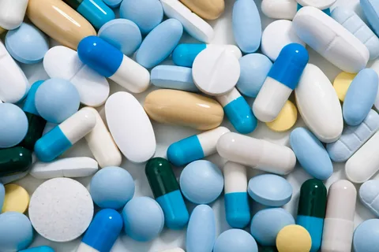

# Антибиотики

## определение 

_природные и синтетические антимикробные веществаruen, широко применяющиеся для лечения инфекций. Антибиотики могут убивать микроорганизмы или останавливать их размножение, позволяя естественным защитным механизмам их устранять._

## классификация

* бета_лактамины
* пеннициллины
* цефалоспорины
* макролиды
* тетрациклины
* аминогликозиды

## Действие антибиотиков
_Антибиотики в отличие от антисептиков обладают антибактериальной активностью не только при наружном применении, но и в биологических средах организма при их системном перорально, внутримышечно, внутривенно, ректально, вагинально и другое_

## Взаимодействие с алкоголем

_Алкоголь может влиять как на активность, так и на метаболизм антибиотиков, влияя на активность ферментов печени, расщепляющих антибиотики. В частности, некоторые антибиотики, включая метронидазол, тинидазол, левомицетин, ко-тримоксазол, цефамандол, кетоконазол, латамоксеф, цефоперазон, цефменоксим и фуразолидон взаимодействуют с метаболизмом алкоголя в организме (блокируют преобразование уксусного альдегида в уксусную кислоту), что приводит к отравлению организма с симптоматикой, включающей тошноту, рвоту, судороги, одышку, при сильном отравлении приводит к смерти. Употребление алкоголя с этими антибиотиками категорически противопоказано. Кроме того, концентрация доксициклина и эритромицина может быть, при определённых обстоятельствах, существенно снижена при употреблении алкоголя_

# конец

## классификация

* йод
* магний
* селен 

## Действие антибиотиков
_Антибиотики в отличие от антисептиков обладают антибактериальной активностью не только при наружном применении, но и в биологических средах организма при их системном перорально, внутримышечно, внутривенно, ректально, вагинально и другое селен цинк_

## классификация12
## классификация12
